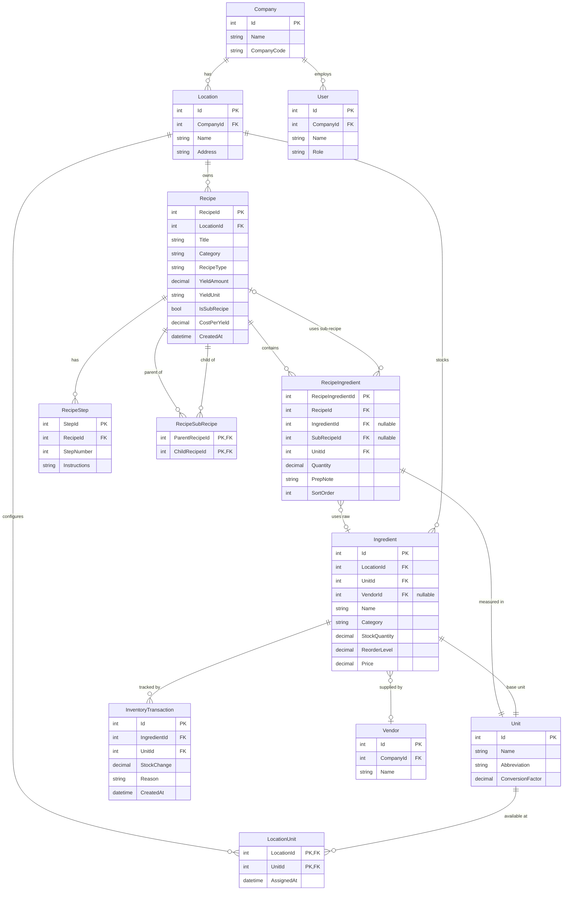

# Recipe Workflow — Implementation Guide

**Project:** Culinary Command  
**Date:** February 26, 2026  
**Target Framework:** .NET 9.0 — Blazor Server (Interactive Server rendering)

---

## Table of Contents

- [Recipe Workflow — Implementation Guide](#recipe-workflow--implementation-guide)
  - [Table of Contents](#table-of-contents)
  - [1. Overview](#1-overview)
  - [2. Current State Audit](#2-current-state-audit)
  - [3. Design Principles \& Framework Alignment](#3-design-principles--framework-alignment)
    - [Vertical Slice Architecture (Feature Folders)](#vertical-slice-architecture-feature-folders)
    - [Interface-First Services](#interface-first-services)
    - [Repository-Light (DbContext Directly in Services)](#repository-light-dbcontext-directly-in-services)
    - [EF Core — Code-First Migrations](#ef-core--code-first-migrations)
    - [Blazor Interactive Server Rendering](#blazor-interactive-server-rendering)
  - [4. Domain Model \& Entity Design](#4-domain-model--entity-design)
    - [4.1 Entity Descriptions](#41-entity-descriptions)
      - [`Recipe`](#recipe)
      - [`RecipeIngredient`](#recipeingredient)
      - [`RecipeStep`](#recipestep)
      - [`RecipeSubRecipe` *(new join/audit table — optional but recommended)*](#recipesubrecipe-new-joinaudit-table--optional-but-recommended)
    - [4.2 Sub-Recipe (Nested Recipe) Pattern](#42-sub-recipe-nested-recipe-pattern)
      - [Recursive Resolution Algorithm](#recursive-resolution-algorithm)
    - [4.3 Key Design Decisions](#43-key-design-decisions)
  - [5. ER Diagram](#5-er-diagram)
    - [Reading the Diagram](#reading-the-diagram)
  - [6. Database Schema Changes](#6-database-schema-changes)
    - [6.1 Changes to Existing Tables](#61-changes-to-existing-tables)
      - [`Recipe` — add two columns](#recipe--add-two-columns)
      - [`RecipeIngredient` — make `IngredientId` nullable, add `SubRecipeId`](#recipeingredient--make-ingredientid-nullable-add-subrecipeid)
      - [`RecipeStep` — increase `Instructions` to 2 048 characters](#recipestep--increase-instructions-to-2-048-characters)
    - [6.2 New Table](#62-new-table)
      - [`RecipeSubRecipe`](#recipesubrecipe)
    - [6.3 Navigation Properties to Add to `Recipe`](#63-navigation-properties-to-add-to-recipe)
    - [6.4 Generating the Migrations](#64-generating-the-migrations)
  - [7. Location-Scoped Unit Management](#7-location-scoped-unit-management)
    - [7.1 Unit Entity \& LocationUnit Join Table](#71-unit-entity--locationunit-join-table)
    - [7.2 IUnitService Changes](#72-iunitservice-changes)
    - [7.3 Blazor Unit Management UI](#73-blazor-unit-management-ui)
  - [8. Inventory Catalog Integration](#8-inventory-catalog-integration)
    - [8.1 Ingredient Source Constraint](#81-ingredient-source-constraint)
    - [8.2 IIngredientService Changes](#82-iingredientservice-changes)
    - [8.3 RecipeForm Ingredient Picker](#83-recipeform-ingredient-picker)
  - [9. Service Layer](#9-service-layer)
    - [9.1 `IRecipeService` Interface](#91-irecipeservice-interface)
    - [9.2 Recursive Cost \& Ingredient Flattening](#92-recursive-cost--ingredient-flattening)
    - [9.3 Circular Reference Guard](#93-circular-reference-guard)
  - [10. Data Transfer Objects (DTOs)](#10-data-transfer-objects-dtos)
    - [`RecipeSummaryDTO`](#recipesummarydto)
    - [`RecipeDetailDTO`](#recipedetaildto)
    - [`RecipeIngredientLineDTO`](#recipeingredientlinedto)
    - [`RecipeStepDTO`](#recipestepdto)
    - [`FlatIngredientLineDTO`](#flatingredientlinedto)
    - [`ProduceRecipeRequest`](#producereciperequest)
  - [11. Blazor Component Architecture](#11-blazor-component-architecture)
    - [11.1 Page \& Component Breakdown](#111-page--component-breakdown)
      - [Pages (thin route stubs)](#pages-thin-route-stubs)
      - [Components (stateful, interactive)](#components-stateful-interactive)
      - [Why extract `IngredientLineRow`?](#why-extract-ingredientlinerow)
    - [11.2 Component Interaction Flow](#112-component-interaction-flow)
  - [12. Inventory Integration](#12-inventory-integration)
  - [13. Validation Strategy](#13-validation-strategy)
  - [14. Migration Strategy](#14-migration-strategy)
  - [15. Unit Testing Requirements](#15-unit-testing-requirements)
    - [Service Tests (`CulinaryCommandUnitTests/Recipe/`)](#service-tests-culinarycommandunittestsrecipe)
    - [Unit Management Service Tests (`CulinaryCommandUnitTests/Inventory/`)](#unit-management-service-tests-culinarycommandunittestsinventory)
    - [Ingredient Service Tests (`CulinaryCommandUnitTests/Inventory/`)](#ingredient-service-tests-culinarycommandunittestsinventory)
    - [Component Tests (`CulinaryCommandUnitTests/Recipe/`)](#component-tests-culinarycommandunittestsrecipe)
  - [16. Implementation Checklist](#16-implementation-checklist)
    - [Phase 1 — Schema \& Entities](#phase-1--schema--entities)
    - [Phase 2 — Service Layer](#phase-2--service-layer)
    - [Phase 3 — DTOs](#phase-3--dtos)
    - [Phase 4 — Blazor Components](#phase-4--blazor-components)
    - [Phase 5 — Testing](#phase-5--testing)

---

## 1. Overview

Recipes are a first-class domain object in Culinary Command. A recipe describes **what ingredients are needed**, **how much of each**, and **the procedure to prepare a dish**. Beyond single-level ingredient lists, professional kitchens rely heavily on **sub-recipes** — a preparatory item (e.g., "House Vinaigrette", "Beurre Blanc", "Brioche Dough") that is itself composed of raw ingredients and is then reused across multiple finished recipes.

This document covers:

- The full entity model required to support both flat and nested recipes.
- The reasoning behind every design decision.
- An ER diagram showing how every entity relates to the rest of the system.
- The service, DTO, and Blazor component architecture needed to implement it end-to-end.
- How recipe execution feeds back into the inventory system.

---

## 2. Current State Audit

The following recipe-related code already exists in the project and **must be preserved or extended**, not replaced.

| Artifact | Location | Status |
|---|---|---|
| `Recipe` entity | `CulinaryCommandApp/Data/Entities/Recipe.cs` | Exists — needs `SubRecipes` navigation |
| `RecipeIngredient` entity | `CulinaryCommandApp/Data/Entities/RecipeIngredient.cs` | Exists — needs `SubRecipeId` FK column |
| `RecipeStep` entity | `CulinaryCommandApp/Data/Entities/RecipeStep.cs` | Exists — `Instructions` should grow to 2 048 chars |
| `RecipeService` | `CulinaryCommandApp/Services/RecipeService.cs` | Exists — must be extracted behind an interface |
| `RecipeForm.razor` | `CulinaryCommandApp/Components/Pages/Recipes/RecipeForm.razor` | Exists — needs sub-recipe picker row and location-scoped ingredient/unit pickers |
| `RecipeList.razor` | `CulinaryCommandApp/Components/Pages/Recipes/RecipeList.razor` | Exists — minor additions needed |
| `RecipeView.razor` | `CulinaryCommandApp/Components/Pages/Recipes/RecipeView.razor` | Exists — needs nested section |
| `Create.razor` / `Edit.razor` | `CulinaryCommandApp/Components/Pages/Recipes/` | Exist — minimal changes |
| `EnumService.GetRecipeTypes()` | `CulinaryCommandApp/Services/EnumService.cs` | Exists — `PrepItem` type already included |
| `AppDbContext` | `CulinaryCommandApp/Data/AppDbContext.cs` | Exists — needs `RecipeSubRecipe` and `LocationUnit` `DbSet`s |
| `Inventory.Entities.Unit` | `CulinaryCommandApp/Inventory/Entities/Unit.cs` | Exists — global (no `LocationId`); needs `LocationUnit` join table for per-location scoping |
| `Data.Entities.MeasurementUnit` | `CulinaryCommandApp/Data/Entities/MeasurementUnit.cs` | Exists — recipe-scoped unit stub; **superseded** by the location-scoped `Unit` approach described in §7 |
| `IUnitService` / `UnitService` | `CulinaryCommandApp/Inventory/Services/` | Exists — needs location-aware query methods |
| `IIngredientService` / `IngredientService` | `CulinaryCommandApp/Inventory/Services/` | Exists — needs `GetByLocationAsync` method |
| `InventoryManagementService` | `CulinaryCommandApp/Inventory/Services/InventoryManagementService.cs` | Exists — `GetItemsByLocationAsync` already scopes by `LocationId`; used as the data source for the ingredient picker |
| `InventoryCatalog.razor` | `CulinaryCommandApp/Inventory/Pages/Inventory/InventoryCatalog.razor` | Exists — the authoritative ingredient list; recipe form must source all ingredient choices from this same data set |

**Gaps identified:**

1. No `IRecipeService` interface — the concrete class is injected directly.
2. `RecipeIngredient` cannot reference a sub-recipe as an "ingredient line" — it only holds an `IngredientId`.
3. No cost-rollup or ingredient-flattening logic exists.
4. No circular-reference guard for nested recipes.
5. `RecipeStep.Instructions` is capped at 256 characters, which is insufficient for multi-sentence instructions.
6. `Inventory.Entities.Unit` has no `LocationId` — units are global and cannot be customised per restaurant location. A `LocationUnit` join table is required (mirroring the `LocationVendor` pattern) so owners can configure which units are available at their location.
7. `IIngredientService` has no location-scoped query method — `RecipeForm` currently has no way to restrict ingredient selection to the ingredients catalogued at the active location (`/inventory-catalog`). A `GetByLocationAsync` method and corresponding DTO are needed.

---

## 3. Design Principles & Framework Alignment

### Vertical Slice Architecture (Feature Folders)

Culinary Command already organises its code in feature folders (`Inventory/`, `PurchaseOrder/`, `Vendor/`). Recipes should follow the same convention:

```
CulinaryCommandApp/
  Recipe/
    DTOs/
    Entities/          ← RecipeSubRecipe lives here
    Mapping/
    Pages/             ← thin page stubs (routes only)
    Components/        ← UI components
    Services/
      Interfaces/
```

All new types live under `CulinaryCommand.Recipe.*` namespaces.

### Interface-First Services

Every service in the Inventory module is backed by an interface (`IIngredientService`, `IUnitService`, etc.) and registered with DI. `RecipeService` must be refactored to implement `IRecipeService` for the same reasons — testability, replaceability, and adherence to the project's own pattern.

### Repository-Light (DbContext Directly in Services)

The project does not use a separate Repository layer — all services depend directly on `AppDbContext`. This pattern should be maintained. Introducing a separate repository layer would be inconsistent with existing code and would add unnecessary abstraction without a demonstrated benefit at this scale.

### EF Core — Code-First Migrations

All schema changes must be expressed as EF Core migrations using `dotnet ef migrations add`. No raw SQL DDL should be written manually.

### Blazor Interactive Server Rendering

All recipe pages use `@rendermode InteractiveServer`, consistent with `InventoryManagement.razor` and existing recipe pages. SignalR keeps the component tree in sync without API controllers.

---

## 4. Domain Model & Entity Design

### 4.1 Entity Descriptions

#### `Recipe`

The core aggregate root. Represents a named, versioned set of instructions and ingredients scoped to a `Location`.

| Column | Type | Notes |
|---|---|---|
| `RecipeId` | `int` PK | Identity |
| `LocationId` | `int` FK | Scoped to a restaurant location |
| `Title` | `string(128)` | Display name |
| `Category` | `string(128)` | e.g., "Produce", "Dairy" (from `Category` enum) |
| `RecipeType` | `string(128)` | e.g., "Entree", "Sauce", "Prep Item" (from `RecipeType` enum) |
| `YieldAmount` | `decimal?` | How much this recipe produces |
| `YieldUnit` | `string(128)` | Unit of the yield (e.g., "Liters", "Each") |
| `IsSubRecipe` | `bool` | `true` when this recipe is intended to be embedded in other recipes |
| `CostPerYield` | `decimal?` | Cached/computed total food cost per yield unit |
| `CreatedAt` | `datetime` | UTC timestamp |

**Why add `IsSubRecipe`?** It is a query-time optimisation. When the `RecipeForm` presents a sub-recipe picker, it needs to filter the recipe list to only show items that make sense as building blocks. Scanning `RecipeType == "Prep Item"` would work but is fragile — a sauce or stock could also be a sub-recipe. A dedicated boolean is unambiguous and queryable with a simple index.

**Why add `CostPerYield`?** Food cost is the primary business metric for any restaurant. Caching the rolled-up cost on the `Recipe` row avoids recursive database traversals on every page load. It is recomputed whenever a recipe is saved.

---

#### `RecipeIngredient`

A single line on a recipe — **either** a raw inventory ingredient **or** a sub-recipe. Exactly one of `IngredientId` and `SubRecipeId` must be non-null (enforced at the service layer and by a check constraint).

| Column | Type | Notes |
|---|---|---|
| `RecipeIngredientId` | `int` PK | Identity |
| `RecipeId` | `int` FK | Parent recipe |
| `IngredientId` | `int?` FK | References `Inventory.Ingredients.Id` — null when line is a sub-recipe |
| `SubRecipeId` | `int?` FK | References `Recipe.RecipeId` — null when line is a raw ingredient |
| `UnitId` | `int` FK | References `Inventory.Units.Id` |
| `Quantity` | `decimal` | Amount of the ingredient or sub-recipe yield used |
| `PrepNote` | `string(256)` | e.g., "finely diced", "room temperature" |
| `SortOrder` | `int` | Display order within the recipe |

**Why allow `SubRecipeId` on `RecipeIngredient` rather than a separate join table?** This is the most widely adopted pattern (used by ChefTec, MarginEdge, and Recipe.ly) because it keeps the ingredient-line concept cohesive. A recipe line is always a quantity of something — whether that something is a raw item or a finished prep. Using a separate join table would require two different loops in every consumer of the recipe, complicating both service and UI code. The nullable pair `(IngredientId | SubRecipeId)` with a check constraint clearly communicates the exclusivity invariant.

---

#### `RecipeStep`

An ordered instruction step for preparing the recipe. The `Instructions` column should be expanded from 256 to 2 048 characters to accommodate real-world step descriptions.

| Column | Type | Notes |
|---|---|---|
| `StepId` | `int` PK | Identity |
| `RecipeId` | `int` FK | Parent recipe |
| `StepNumber` | `int` | 1-based ordinal |
| `Instructions` | `string(2048)` | Full preparation instruction |

---

#### `RecipeSubRecipe` *(new join/audit table — optional but recommended)*

When a sub-recipe is used as a line in a parent recipe, the relationship is already captured by `RecipeIngredient.SubRecipeId`. However, maintaining a direct `RecipeSubRecipe` join table between the two `Recipe` rows provides several benefits:

- Enables a fast "where is this sub-recipe used?" reverse lookup without scanning `RecipeIngredient`.
- Makes circular-reference detection via a simple SQL query feasible.
- Mirrors how the `UserLocation` and `ManagerLocation` join tables handle M:M relationships in the existing schema.

| Column | Type | Notes |
|---|---|---|
| `ParentRecipeId` | `int` FK | The recipe that includes the sub-recipe |
| `ChildRecipeId` | `int` FK | The sub-recipe being embedded |

Composite PK: `(ParentRecipeId, ChildRecipeId)`.

This table is **derived** from `RecipeIngredient` rows — it is populated automatically by `RecipeService` whenever a recipe is saved. It should never be written to directly by UI code.

---

### 4.2 Sub-Recipe (Nested Recipe) Pattern

A sub-recipe is a `Recipe` where `IsSubRecipe = true`. It is referenced on a parent recipe's ingredient list via `RecipeIngredient.SubRecipeId`. The depth of nesting is unbounded by the schema — a sub-recipe can itself contain another sub-recipe.

**Example hierarchy:**

```
Caesar Salad  (Entree)
├── 2 heads Romaine Lettuce        [raw ingredient]
├── 0.5 cup Croutons               [raw ingredient]
└── 1 oz Caesar Dressing           [sub-recipe → Prep Item]
    ├── 0.25 cup Olive Oil         [raw ingredient]
    ├── 2 cloves Garlic            [raw ingredient]
    └── 1 tsp Anchovy Paste        [raw ingredient]
```

When "Caesar Salad" is prepared (i.e., "produced"):

1. Stock of Romaine Lettuce decreases by 2 heads.
2. Stock of Croutons decreases by 0.5 cup.
3. The service **recursively resolves** Caesar Dressing and deducts its constituent ingredients proportionally based on the quantity of dressing used.

#### Recursive Resolution Algorithm

```
FlattenIngredients(recipeId, multiplier, visited):
    if recipeId ∈ visited → throw CircularReferenceException
    add recipeId to visited

    for each line in RecipeIngredients where RecipeId = recipeId:
        if line.IngredientId is not null:
            yield (IngredientId, Quantity × multiplier, UnitId)
        else:
            subYield = SubRecipe.YieldAmount ?? 1
            ratio = line.Quantity / subYield
            yield from FlattenIngredients(line.SubRecipeId, multiplier × ratio, visited)
```

The `visited` set prevents infinite loops when a recipe accidentally references itself through an indirect chain. This guard must be applied at save time (to reject the configuration) **and** at resolve time (as a defence-in-depth measure).

---

### 4.3 Key Design Decisions

| Decision | Rationale |
|---|---|
| Sub-recipe FK lives on `RecipeIngredient`, not a separate table | Keeps the "ingredient line" concept cohesive; one loop for consumers |
| `IsSubRecipe` boolean on `Recipe` | Efficient UI filtering; explicit intent over convention |
| `CostPerYield` cached on `Recipe` | Avoids recursive DB traversal on every render; recomputed on save |
| `RecipeSubRecipe` mirror table | Fast reverse lookup ("used in") and circular reference detection via SQL |
| Interface `IRecipeService` | Matches project pattern; enables unit testing without a DB |
| No separate Repository layer | Consistent with existing `IngredientService`, `UnitService`, etc. |
| `RecipeType` stays string constant (not DB enum) | Matches existing `Category` and `RecipeType` constant classes; avoids migrations for new types |
| `Location`-scoped recipes | Consistent with Inventory — every recipe belongs to one `Location`; a `Company` can have multiple locations with different menus |
| `LocationUnit` join table for per-location unit configuration | Mirrors `LocationVendor`; allows each restaurant to curate the units available in their recipe forms without altering the global `Unit` catalogue |
| Ingredient picker sourced exclusively from `/inventory-catalog` (location-scoped) | Guarantees that every ingredient on a recipe exists in the location's live inventory, enabling accurate stock deduction and cost calculation |
| `MeasurementUnit` entity superseded by location-scoped `Unit` usage | `Data.Entities.MeasurementUnit` was an incomplete stub; the authoritative unit entity is `Inventory.Entities.Unit`, now scoped via `LocationUnit` |

---

## 5. ER Diagram



### Reading the Diagram

- **`Company → Location → Recipe`** — The ownership chain. Every recipe belongs to exactly one location, which belongs to exactly one company. This scopes the recipe book correctly for multi-tenant deployments.
- **`Location → LocationUnit ← Unit`** — Each location configures its own set of allowed units (e.g., a bakery might enable "grams" and "cups" but not "fluid ounces"). This mirrors the `LocationVendor` pattern already used in the Vendor module.
- **`Recipe → RecipeIngredient`** — One-to-many; a recipe has zero or more ingredient lines.
- **`RecipeIngredient → Ingredient`** (nullable) — When a line references a raw ingredient, this FK is populated. The ingredient **must** belong to the same `LocationId` as the parent recipe — enforced at the service layer and pre-filtered in the UI picker.
- **`RecipeIngredient → Unit`** — The unit used on this line must be one that is enabled for the location via `LocationUnit`.
- **`RecipeIngredient → Recipe`** (nullable, `SubRecipeId`) — When a line references a sub-recipe, this FK is populated instead. The same `RecipeIngredient` entity handles both cases, which is the discriminated-union pattern.
- **`Recipe → RecipeSubRecipe ← Recipe`** — The mirror join table sits between two `Recipe` rows, recording which recipes embed which. The double `Recipe` arrow reflects the self-referential many-to-many.
- **`Ingredient → InventoryTransaction`** — When a recipe is produced, the service flattens all raw ingredients and creates one `InventoryTransaction` per unique ingredient, using the existing `InventoryTransactionService`.

---

## 6. Database Schema Changes

### 6.1 Changes to Existing Tables

#### `Recipe` — add two columns

```csharp
public bool IsSubRecipe { get; set; } = false;
public decimal? CostPerYield { get; set; }
```

#### `RecipeIngredient` — make `IngredientId` nullable, add `SubRecipeId`

```csharp
public int? IngredientId { get; set; }
public int? SubRecipeId { get; set; }
public Recipe? SubRecipe { get; set; }
```

The existing `IngredientId` column is currently non-nullable (it has no `?`). Making it nullable is a **breaking schema change** — a migration is required and existing rows must be verified to be unaffected.

#### `RecipeStep` — increase `Instructions` to 2 048 characters

```csharp
[MaxLength(2048)]
public string? Instructions { get; set; }
```

### 6.2 New Table

#### `RecipeSubRecipe`

```csharp
namespace CulinaryCommand.Recipe.Entities
{
    public class RecipeSubRecipe
    {
        public int ParentRecipeId { get; set; }
        public Recipe? ParentRecipe { get; set; }

        public int ChildRecipeId { get; set; }
        public Recipe? ChildRecipe { get; set; }
    }
}
```

Registered in `AppDbContext`:

```csharp
public DbSet<RecipeSubRecipe> RecipeSubRecipes => Set<RecipeSubRecipe>();
```

Fluent configuration in `OnModelCreating`:

```csharp
modelBuilder.Entity<RecipeSubRecipe>()
    .HasKey(rs => new { rs.ParentRecipeId, rs.ChildRecipeId });

modelBuilder.Entity<RecipeSubRecipe>()
    .HasOne(rs => rs.ParentRecipe)
    .WithMany(r => r.SubRecipeUsages)
    .HasForeignKey(rs => rs.ParentRecipeId)
    .OnDelete(DeleteBehavior.Cascade);

modelBuilder.Entity<RecipeSubRecipe>()
    .HasOne(rs => rs.ChildRecipe)
    .WithMany(r => r.UsedInRecipes)
    .HasForeignKey(rs => rs.ChildRecipeId)
    .OnDelete(DeleteBehavior.Restrict);
```

`DeleteBehavior.Restrict` on the child side prevents accidentally orphaning sub-recipe references when the child recipe is deleted. The service layer should check for usages before allowing deletion of a sub-recipe.

### 6.3 Navigation Properties to Add to `Recipe`

```csharp
public ICollection<RecipeSubRecipe> SubRecipeUsages { get; set; } = new List<RecipeSubRecipe>();
public ICollection<RecipeSubRecipe> UsedInRecipes { get; set; } = new List<RecipeSubRecipe>();
```

### 6.4 Generating the Migrations

```bash
dotnet ef migrations add AddSubRecipeSupport \
  --project CulinaryCommandApp \
  --startup-project CulinaryCommandApp
```

> See §14 (Migration Strategy) for the full ordered sequence, which now includes the `LocationUnit` table and the retirement of `MeasurementUnit`.

---

## 7. Location-Scoped Unit Management

### 7.1 Unit Entity & LocationUnit Join Table

`Inventory.Entities.Unit` is currently a **global** catalogue — every location sees every unit. Restaurant owners need to configure a curated subset of units for their location (e.g., a bakery enables grams and cups; a bar enables millilitres and fluid ounces). This is modelled with a `LocationUnit` join table, exactly mirroring how `LocationVendor` works in the Vendor module.

Create `CulinaryCommandApp/Inventory/Entities/LocationUnit.cs`:

```csharp
using System.Text.Json.Serialization;
using CulinaryCommand.Data.Entities;

namespace CulinaryCommand.Inventory.Entities
{
    /// <summary>
    /// Join table linking a Unit to a specific Location.
    /// Tracks which units of measurement are enabled for a given restaurant location.
    /// </summary>
    public class LocationUnit
    {
        public int LocationId { get; set; }

        [JsonIgnore]
        public Location Location { get; set; } = default!;

        public int UnitId { get; set; }

        [JsonIgnore]
        public Unit Unit { get; set; } = default!;

        public DateTime AssignedAt { get; set; } = DateTime.UtcNow;
    }
}
```

Register in `AppDbContext`:

```csharp
public DbSet<LocationUnit> LocationUnits => Set<LocationUnit>();
```

Fluent configuration in `OnModelCreating`:

```csharp
modelBuilder.Entity<LocationUnit>()
    .HasKey(lu => new { lu.LocationId, lu.UnitId });

modelBuilder.Entity<LocationUnit>()
    .HasOne(lu => lu.Location)
    .WithMany(l => l.LocationUnits)
    .HasForeignKey(lu => lu.LocationId);

modelBuilder.Entity<LocationUnit>()
    .HasOne(lu => lu.Unit)
    .WithMany(u => u.LocationUnits)
    .HasForeignKey(lu => lu.UnitId);
```

Add the corresponding navigation properties:

- `Location` entity: `public ICollection<LocationUnit> LocationUnits { get; set; } = new List<LocationUnit>();`
- `Unit` entity: `public ICollection<LocationUnit> LocationUnits { get; set; } = new List<LocationUnit>();`

**Why not add `LocationId` directly to `Unit`?** A unit like "grams" is not owned by one location — it is a shared reference. The join table lets multiple locations enable the same unit independently, and lets each location disable units they never use, keeping their dropdowns clean.

**`MeasurementUnit` retirement:** `Data.Entities.MeasurementUnit` was an incomplete stub that duplicated `Inventory.Entities.Unit` without location scoping. Now that `Unit` is location-scoped via `LocationUnit`, `MeasurementUnit` should be marked obsolete and removed in a follow-up cleanup migration. Until that migration runs, `AppDbContext.MeasurementUnits` can remain registered but should not be referenced by any new code.

---

### 7.2 IUnitService Changes

Add two location-scoped methods to `IUnitService` (`CulinaryCommandApp/Inventory/Services/Interfaces/IUnitService.cs`):

```csharp
/// <summary>Returns only the units enabled for a specific location.</summary>
Task<List<Unit>> GetByLocationAsync(int locationId, CancellationToken cancellationToken = default);

/// <summary>Sets the complete list of units enabled at a location, adding/removing as needed.</summary>
Task SetLocationUnitsAsync(int locationId, IEnumerable<int> unitIds, CancellationToken cancellationToken = default);
```

`UnitService` implements these by querying `_db.LocationUnits` — the same pattern used by `VendorService.GetVendorsByLocationAsync` and `VendorService.SetLocationVendorsAsync`.

---

### 7.3 Blazor Unit Management UI

Create a unit-configuration page under the Inventory feature folder, modelled after the existing Vendor management pages:

| File | Route | Purpose |
|---|---|---|
| `CulinaryCommandApp/Inventory/Pages/Units/Index.razor` | `/units` | List all global units; shows which are enabled for the current location |
| `CulinaryCommandApp/Inventory/Pages/Units/UnitForm.razor` | (component) | Inline form for creating/editing a unit (name, abbreviation, conversion factor) |

The `Index.razor` page renders a two-column layout:
- **Left:** all available units in the global catalogue with an enable/disable toggle per location.
- **Right:** a form to create a new unit (which is immediately added to the global catalogue; the owner can then enable it for their location).

Add a "Units" link to `NavMenu.razor` under the Inventory section, consistent with the existing "Vendors" link pattern.

**Role gating:** Only managers and admins (the same `priv` flag check used on recipe and vendor pages) may create, edit, or assign units. Read-only employees see the enabled units list but cannot modify it.

---

## 8. Inventory Catalog Integration

### 8.1 Ingredient Source Constraint

When building a recipe, the ingredient picker in `IngredientLineRow` must show **only** the ingredients that are catalogued at the current location — i.e., the exact same data set that powers `/inventory-catalog`. This enforces a hard invariant: every ingredient on a recipe has a known stock record at the location, which makes cost calculation and inventory deduction reliable.

`Inventory.Entities.Ingredient` already has a `LocationId` FK. `InventoryManagementService.GetItemsByLocationAsync(locationId)` already filters on this column and is the existing data source for the catalog page. The recipe form must use this same method (or a thin wrapper) rather than the unscoped `IIngredientService.GetAllAsync`.

**Why not allow ingredients from other locations?** A recipe belongs to one location. If it could reference an ingredient from a different location, the service would have no valid stock row to deduct from when the recipe is produced. Cross-location sharing is a future concern and should be designed explicitly when needed.

---

### 8.2 IIngredientService Changes

Add one location-scoped method to `IIngredientService` (`CulinaryCommandApp/Inventory/Services/Interfaces/IIngredientService.cs`):

```csharp
/// <summary>
/// Returns all ingredients belonging to a specific location,
/// matching the data shown on the /inventory-catalog page.
/// </summary>
Task<List<Ingredient>> GetByLocationAsync(int locationId, CancellationToken cancellationToken = default);
```

Implement in `IngredientService`:

```csharp
public async Task<List<Ingredient>> GetByLocationAsync(
    int locationId, CancellationToken cancellationToken = default)
{
    return await _db.Ingredients
        .AsNoTracking()
        .Include(i => i.Unit)
        .Where(i => i.LocationId == locationId)
        .OrderBy(i => i.Category)
        .ThenBy(i => i.Name)
        .ToListAsync(cancellationToken);
}
```

This is a direct analogue to `InventoryManagementService.GetItemsByLocationAsync` but returns the raw `Ingredient` entity (with its `Unit` navigation loaded) rather than a display DTO, which is what the recipe service needs for cost calculation.

---

### 8.3 RecipeForm Ingredient Picker

`IngredientLineRow.razor` currently populates `AvailableIngredients` from an unscoped call. This must be updated:

1. `IngredientLineRow` receives the current `LocationId` as a `[Parameter]`.
2. On initialisation (or when switching to "raw ingredient" mode), it calls `IIngredientService.GetByLocationAsync(LocationId)`.
3. The ingredient dropdown is populated from this location-scoped list — identical to the `/inventory-catalog` catalogue.
4. The unit dropdown for the line is populated from `IUnitService.GetByLocationAsync(LocationId)` — the location's configured units.

Similarly, the unit dropdown on `RecipeForm` for the recipe's own `YieldUnit` field must be populated from the location's configured units rather than the global `Unit` table.

**Cascaded category filter (optional enhancement):** The ingredient picker may optionally offer a category pre-filter (mirroring the category filter on `/inventory-catalog`) to help users find ingredients quickly. Since `Ingredient.Category` is already populated in the data, this requires no schema change — just a client-side `@bind` filter on the dropdown list.

---

## 9. Service Layer

### 9.1 `IRecipeService` Interface

Create `CulinaryCommandApp/Recipe/Services/Interfaces/IRecipeService.cs`:

```csharp
using CulinaryCommand.Data.Entities;
using CulinaryCommand.Recipe.DTOs;

namespace CulinaryCommand.Recipe.Services.Interfaces
{
    public interface IRecipeService
    {
        Task<List<RecipeSummaryDTO>> GetAllByLocationAsync(int locationId, CancellationToken ct = default);
        Task<RecipeDetailDTO?> GetDetailAsync(int recipeId, CancellationToken ct = default);
        Task<List<RecipeSummaryDTO>> GetSubRecipesForLocationAsync(int locationId, CancellationToken ct = default);
        Task<Data.Entities.Recipe> CreateAsync(Data.Entities.Recipe recipe, CancellationToken ct = default);
        Task UpdateAsync(Data.Entities.Recipe recipe, CancellationToken ct = default);
        Task DeleteAsync(int recipeId, CancellationToken ct = default);
        Task<List<FlatIngredientLineDTO>> FlattenIngredientsAsync(int recipeId, decimal multiplier = 1m, CancellationToken ct = default);
        Task DeductInventoryAsync(int recipeId, decimal servingsProduced, CancellationToken ct = default);
    }
}
```

**Why `RecipeSummaryDTO` and `RecipeDetailDTO`?** Returning the raw EF entity from a service is acceptable in this project (as seen in `RecipeService.GetAllByLocationIdAsync`) but the detail view needs richer data (ingredient names, sub-recipe titles, nested cost breakdowns) that would require multiple `Include` chains. Projecting into DTOs at the service layer avoids lazy-loading pitfalls and keeps Blazor components free of database concerns.

---

### 9.2 Recursive Cost & Ingredient Flattening

Create `CulinaryCommandApp/Recipe/Services/RecipeService.cs`. Key method:

```csharp
public async Task<List<FlatIngredientLineDTO>> FlattenIngredientsAsync(
    int recipeId, decimal multiplier = 1m, CancellationToken ct = default)
{
    return await FlattenCoreAsync(recipeId, multiplier, new HashSet<int>(), ct);
}

private async Task<List<FlatIngredientLineDTO>> FlattenCoreAsync(
    int recipeId, decimal multiplier, HashSet<int> visited, CancellationToken ct)
{
    if (!visited.Add(recipeId))
        throw new InvalidOperationException(
            $"Circular sub-recipe reference detected at RecipeId {recipeId}.");

    var lines = await _db.RecipeIngredients
        .AsNoTracking()
        .Include(ri => ri.Ingredient)
        .Include(ri => ri.Unit)
        .Include(ri => ri.SubRecipe)
        .Where(ri => ri.RecipeId == recipeId)
        .ToListAsync(ct);

    var result = new List<FlatIngredientLineDTO>();

    foreach (var line in lines)
    {
        if (line.IngredientId.HasValue)
        {
            result.Add(new FlatIngredientLineDTO
            {
                IngredientId = line.IngredientId.Value,
                IngredientName = line.Ingredient!.Name,
                Quantity = line.Quantity * multiplier,
                UnitId = line.UnitId,
                UnitName = line.Unit?.Name ?? string.Empty
            });
        }
        else if (line.SubRecipeId.HasValue)
        {
            var subYield = line.SubRecipe?.YieldAmount ?? 1m;
            var ratio = line.Quantity / subYield;
            var nested = await FlattenCoreAsync(
                line.SubRecipeId.Value, multiplier * ratio, visited, ct);
            result.AddRange(nested);
        }
    }

    visited.Remove(recipeId);
    return result;
}
```

**Why remove `recipeId` from `visited` after processing?** The visited set guards against *cycles*, not against a sub-recipe being reused in multiple unrelated branches of the same recipe (diamond dependency). Removing the ID after a branch completes allows legitimate multi-use without false positives.

---

### 9.3 Circular Reference Guard

A guard must also run at **save time**, not just at flatten time. Before persisting any `RecipeIngredient` with a `SubRecipeId`, the service must verify the candidate sub-recipe does not (directly or transitively) reference the parent recipe.

```csharp
private async Task<bool> WouldCreateCycleAsync(
    int parentRecipeId, int proposedChildId, CancellationToken ct)
{
    var visited = new HashSet<int> { parentRecipeId };
    var queue = new Queue<int>();
    queue.Enqueue(proposedChildId);

    while (queue.Count > 0)
    {
        var current = queue.Dequeue();
        if (!visited.Add(current))
            return true;

        var children = await _db.RecipeSubRecipes
            .Where(rs => rs.ParentRecipeId == current)
            .Select(rs => rs.ChildRecipeId)
            .ToListAsync(ct);

        foreach (var child in children)
            queue.Enqueue(child);
    }

    return false;
}
```

This BFS traversal leverages the `RecipeSubRecipe` mirror table for efficient graph traversal, avoiding a full `RecipeIngredient` scan.

---

## 10. Data Transfer Objects (DTOs)

Create under `CulinaryCommandApp/Recipe/DTOs/`:

### `RecipeSummaryDTO`

Used in list views — lightweight, no nested data.

```csharp
public class RecipeSummaryDTO
{
    public int RecipeId { get; set; }
    public string Title { get; set; } = string.Empty;
    public string Category { get; set; } = string.Empty;
    public string RecipeType { get; set; } = string.Empty;
    public decimal? YieldAmount { get; set; }
    public string YieldUnit { get; set; } = string.Empty;
    public bool IsSubRecipe { get; set; }
    public decimal? CostPerYield { get; set; }
}
```

### `RecipeDetailDTO`

Used in the detail/view page — includes flattened ingredient lines and steps.

```csharp
public class RecipeDetailDTO
{
    public int RecipeId { get; set; }
    public string Title { get; set; } = string.Empty;
    public string Category { get; set; } = string.Empty;
    public string RecipeType { get; set; } = string.Empty;
    public decimal? YieldAmount { get; set; }
    public string YieldUnit { get; set; } = string.Empty;
    public bool IsSubRecipe { get; set; }
    public decimal? CostPerYield { get; set; }
    public List<RecipeIngredientLineDTO> Ingredients { get; set; } = new();
    public List<RecipeStepDTO> Steps { get; set; } = new();
    public List<RecipeSummaryDTO> UsedInRecipes { get; set; } = new();
}
```

### `RecipeIngredientLineDTO`

Represents one line in the recipe, abstracting over raw vs. sub-recipe.

```csharp
public class RecipeIngredientLineDTO
{
    public int RecipeIngredientId { get; set; }
    public int SortOrder { get; set; }
    public decimal Quantity { get; set; }
    public string UnitName { get; set; } = string.Empty;
    public int UnitId { get; set; }
    public string PrepNote { get; set; } = string.Empty;

    public bool IsSubRecipe => SubRecipeId.HasValue;

    public int? IngredientId { get; set; }
    public string? IngredientName { get; set; }

    public int? SubRecipeId { get; set; }
    public string? SubRecipeTitle { get; set; }
}
```

### `RecipeStepDTO`

```csharp
public class RecipeStepDTO
{
    public int StepId { get; set; }
    public int StepNumber { get; set; }
    public string Instructions { get; set; } = string.Empty;
}
```

### `FlatIngredientLineDTO`

Used internally by the service for cost rollup and inventory deduction — never sent to the UI directly.

```csharp
public class FlatIngredientLineDTO
{
    public int IngredientId { get; set; }
    public string IngredientName { get; set; } = string.Empty;
    public decimal Quantity { get; set; }
    public int UnitId { get; set; }
    public string UnitName { get; set; } = string.Empty;
}
```

### `ProduceRecipeRequest`

Triggers inventory deduction when a recipe is produced/executed.

```csharp
public class ProduceRecipeRequest
{
    public int RecipeId { get; set; }
    public decimal ServingsProduced { get; set; } = 1m;
    public string? Notes { get; set; }
}
```

---

## 11. Blazor Component Architecture

### 11.1 Page & Component Breakdown

All files live under `CulinaryCommandApp/Components/Pages/Recipes/` (pages) and a new `CulinaryCommandApp/Recipe/Components/` folder (reusable components).

#### Pages (thin route stubs)

| File | Route | Purpose |
|---|---|---|
| `Index.razor` | `/recipes` | Hosts `RecipeList` |
| `Create.razor` | `/recipes/create` | Hosts `RecipeForm` in create mode |
| `Edit.razor` | `/recipes/edit/{id:int}` | Hosts `RecipeForm` in edit mode |
| `RecipeView.razor` | `/recipes/view/{id:int}` | Hosts `RecipeDetailView` |

#### Components (stateful, interactive)

| Component | Location | Responsibility |
|---|---|---|
| `RecipeList.razor` | `Components/Pages/Recipes/` | Table of recipes for current location; search, filter, navigate |
| `RecipeForm.razor` | `Components/Pages/Recipes/` | Create/edit recipe; ingredient lines; sub-recipe picker; step editor |
| `RecipeDetailView.razor` | `Recipe/Components/` | Read-only recipe display with nested sub-recipe expansion |
| `IngredientLineRow.razor` | `Recipe/Components/` | A single ingredient line within `RecipeForm` — handles toggle between raw and sub-recipe mode |
| `SubRecipePicker.razor` | `Recipe/Components/` | Dropdown/search to select a sub-recipe from the same location |
| `RecipeCostBadge.razor` | `Recipe/Components/` | Inline display of `CostPerYield` with currency formatting |
| `ProduceRecipeDialog.razor` | `Recipe/Components/` | Modal that accepts servings count and triggers inventory deduction |

#### Why extract `IngredientLineRow`?

The current `RecipeForm.razor` renders all ingredient lines inline in a `@foreach` loop. Adding sub-recipe support introduces a toggle (raw vs. sub-recipe), conditional dropdowns, and nested display logic. Extracting each line to its own component keeps `RecipeForm` readable, allows the row to manage its own state (selected category, loaded ingredients list, sub-recipe mode), and makes it independently testable using `bUnit`.

---

### 11.2 Component Interaction Flow

```
RecipeForm  [LocationId param]
 ├── [n × IngredientLineRow]  [LocationId param]
 │    ├── mode: "raw"        → CategoryFilter (client-side) → IngredientSelect
 │    │                           (IIngredientService.GetByLocationAsync(LocationId))
 │    │                        → UnitSelect
 │    │                           (IUnitService.GetByLocationAsync(LocationId))
 │    └── mode: "sub-recipe" → SubRecipePicker
 │                              (IRecipeService.GetSubRecipesForLocationAsync(LocationId))
 ├── YieldUnit select          (IUnitService.GetByLocationAsync(LocationId))
 ├── [n × StepEditor]          (inline textarea rows, no extraction needed yet)
 └── OnValidSubmit ──────────→ IRecipeService.CreateAsync / UpdateAsync
                                  └── ValidateIngredientsBelongToLocation()
                                  └── ValidateUnitsEnabledForLocation()
                                  └── ValidateNoCycle()
                                  └── RecalculateCost() → updates CostPerYield
                                  └── SyncRecipeSubRecipeTable()

RecipeDetailView
 ├── RecipeCostBadge
 ├── [n × IngredientLineRow (read-only)]
 │    └── if IsSubRecipe → nested RecipeDetailView (collapsible)
 └── ProduceRecipeDialog (manager/admin only)
      └── IRecipeService.DeductInventoryAsync()
           └── FlattenIngredients() → IInventoryTransactionService.RecordAsync() × N
```

**Why is `ProduceRecipeDialog` on the detail view?** Producing a recipe is an intentional, high-consequence action (it modifies stock). Placing it behind a confirmation modal on the detail view (rather than the list) ensures the user has reviewed the recipe before committing inventory changes. Role gating (`priv` flag, as used in `RecipeList.razor`) should restrict the "Produce" button to managers and admins.

---

## 12. Inventory Integration

When a recipe is "produced" (`DeductInventoryAsync`):

1. Call `FlattenIngredientsAsync(recipeId, servingsProduced)` to get the complete list of raw ingredients and quantities.
2. Group lines by `IngredientId` and sum quantities (a sub-recipe's ingredient may appear in multiple branches).
3. For each grouped ingredient, call `IInventoryTransactionService.RecordAsync` with a negative `StockChange` and `Reason = $"Recipe production: {recipe.Title}"`.
4. All `RecordAsync` calls must succeed or all must roll back — wrap in a `using var tx = await _db.Database.BeginTransactionAsync()` block inside the service. This mirrors the existing transaction pattern in `InventoryTransactionService.RecordAsync`.

**Why use the existing `InventoryTransactionService`?** It already contains the conditional update SQL (`UPDATE Ingredients SET StockQuantity = StockQuantity + {delta} WHERE ...`) that prevents stock going negative in a concurrent environment. Reusing it avoids duplicating this critical concurrency logic.

**Unit conversion note:** `RecipeIngredient.UnitId` references `Inventory.Units` which carries a `ConversionFactor`. When deducting stock, the service must convert the recipe quantity from the recipe's measurement unit to the ingredient's base stock unit before deducting. Example: recipe specifies "500 ml" cream, but the ingredient is tracked in "liters" — deduct 0.5 L.

---

## 13. Validation Strategy

All validation is enforced in two places: the service layer (always) and the Blazor form (for user feedback).

| Rule | Where enforced |
|---|---|
| `Recipe.Title` required, max 128 chars | Data annotation + service guard |
| `Recipe.Category` must be a valid `Category` constant | Service guard |
| `Recipe.RecipeType` must be a valid `RecipeType` constant | Service guard |
| Each `RecipeIngredient` line: exactly one of `IngredientId` / `SubRecipeId` non-null | Service guard + Blazor toggle logic |
| Each `RecipeIngredient` line: `Quantity > 0` | Data annotation |
| `Recipe.YieldAmount > 0` when `YieldUnit` is set | Service guard |
| Sub-recipe reference must not create a circular dependency | `WouldCreateCycleAsync()` in service |
| Sub-recipe must belong to the same `LocationId` as the parent recipe | Service guard |
| Cannot delete a recipe that is referenced as a sub-recipe by another recipe | Service `DeleteAsync` pre-check |
| `RecipeIngredient.IngredientId` must reference an ingredient belonging to the same `LocationId` as the recipe | Service guard — queries `Ingredient.LocationId == recipe.LocationId` before save |
| `RecipeIngredient.UnitId` must reference a unit enabled for the recipe's location via `LocationUnit` | Service guard — queries `LocationUnits` before save |
| `Recipe.YieldUnit` (when stored as a `UnitId`) must be a unit enabled for the location | Service guard |
| Cannot delete a `Unit` that is still referenced by any `RecipeIngredient` or `Ingredient` at that location | `UnitService.DeleteAsync` pre-check |
| Cannot disable (remove from `LocationUnit`) a unit that is still used on an active ingredient or recipe line at that location | Service guard in `SetLocationUnitsAsync` |

**Blazor form validation** should use `<EditForm>` with `<DataAnnotationsValidator>` and `<ValidationSummary>`. For the sub-recipe cycle check, since it requires a DB round-trip, it should be surfaced as a non-field error message rendered in a `<div class="alert alert-danger">` block after the `Save` button is clicked.

---

## 14. Migration Strategy

Migrations must be applied in order. The recommended sequence is:

1. **`AddIsSubRecipeAndCostPerYield`** — adds `IsSubRecipe` (bit, default 0) and `CostPerYield` (decimal, nullable) to `Recipes`.
2. **`MakeRecipeIngredientIngredientIdNullable`** — alters `IngredientId` to nullable and adds `SubRecipeId` (int, nullable, FK to `Recipes(RecipeId)`).
3. **`AddRecipeSubRecipeTable`** — creates the `RecipeSubRecipes` join table with composite PK and both FKs.
4. **`ExpandRecipeStepInstructions`** — increases `Instructions` from `nvarchar(256)` to `nvarchar(2048)`.
5. **`AddLocationUnitTable`** — creates the `LocationUnits` join table (`LocationId`, `UnitId`, `AssignedAt`) with composite PK and FKs to `Locations` and `Units`. Seed: for each existing `Location`, insert a `LocationUnit` row for every `Unit` currently in the database so no existing location loses access to units after the migration.
6. **`DeprecateMeasurementUnit`** *(deferred cleanup)* — drops the `MeasurementUnits` table and removes the corresponding `DbSet` registration. This migration should only run after confirming no production rows exist in `MeasurementUnits`.

Each migration should be reviewed in its generated `.cs` file before applying. Verify that step 2 does not drop and recreate the existing `RecipeIngredient` table — check the `MigrationBuilder` output carefully. For step 5, review the seed logic to ensure all existing locations receive sensible default units.

---

## 15. Unit Testing Requirements

Tests live in `CulinaryCommandUnitTests/`. The project already uses `bUnit` for Blazor component tests.

### Service Tests (`CulinaryCommandUnitTests/Recipe/`)

| Test Class | Covers |
|---|---|
| `RecipeServiceFlattenTests` | Single-level, two-level nested, diamond dependency, circular reference detection |
| `RecipeServiceCostTests` | Cost rollup correctness for flat and nested recipes |
| `RecipeServiceCycleDetectionTests` | `WouldCreateCycleAsync` returns true for direct and indirect cycles |
| `RecipeServiceProduceTests` | `DeductInventoryAsync` calls `IInventoryTransactionService.RecordAsync` with correct quantities; rollback on insufficient stock |
| `RecipeServiceIngredientScopeTests` | `CreateAsync` / `UpdateAsync` reject ingredients whose `LocationId` does not match the recipe's location |
| `RecipeServiceUnitScopeTests` | `CreateAsync` / `UpdateAsync` reject units not present in `LocationUnits` for the recipe's location |

### Unit Management Service Tests (`CulinaryCommandUnitTests/Inventory/`)

| Test Class | Covers |
|---|---|
| `UnitServiceLocationTests` | `GetByLocationAsync` returns only units with a matching `LocationUnit` row; `SetLocationUnitsAsync` adds and removes rows correctly |
| `UnitServiceDeleteGuardTests` | `DeleteAsync` throws when unit is referenced by an active `RecipeIngredient` or `Ingredient` |
| `UnitServiceDisableGuardTests` | `SetLocationUnitsAsync` throws when attempting to remove a unit still in use at that location |

### Ingredient Service Tests (`CulinaryCommandUnitTests/Inventory/`)

| Test Class | Covers |
|---|---|
| `IngredientServiceLocationTests` | `GetByLocationAsync` returns only ingredients with matching `LocationId`; ordering by category then name |

### Component Tests (`CulinaryCommandUnitTests/Recipe/`)

| Test Class | Covers |
|---|---|
| `IngredientLineRowTests` | Toggle between raw and sub-recipe mode; ingredient dropdown populated from location-scoped list; unit dropdown populated from location-configured units |
| `RecipeFormTests` | Form submits valid data; shows error when cycle detected; ingredient and unit dropdowns are empty when no location context provided |
| `RecipeDetailViewTests` | Nested sub-recipe section renders; "Produce" button hidden for non-managers |

All service tests should use an in-memory EF Core database (`UseInMemoryDatabase`) or Moq for `AppDbContext` to avoid a live DB dependency.

---

## 16. Implementation Checklist

Use this checklist to track progress. Complete items in order — later steps depend on earlier ones.

### Phase 1 — Schema & Entities
- [x] Add `IsSubRecipe` and `CostPerYield` to `Recipe` entity
- [ ] Make `RecipeIngredient.IngredientId` nullable; add `SubRecipeId` and `SubRecipe` navigation
- [ ] Expand `RecipeStep.Instructions` to `MaxLength(2048)`
- [ ] Create `RecipeSubRecipe` entity under `CulinaryCommandApp/Recipe/Entities/`
- [ ] Add `SubRecipeUsages` and `UsedInRecipes` navigation to `Recipe`
- [ ] Register `RecipeSubRecipes` `DbSet` in `AppDbContext`
- [ ] Add Fluent API configuration for `RecipeSubRecipe` in `OnModelCreating`
- [ ] Create `LocationUnit` entity under `CulinaryCommandApp/Inventory/Entities/`
- [ ] Add `LocationUnits` navigation to `Location` entity
- [ ] Add `LocationUnits` navigation to `Unit` entity
- [ ] Register `LocationUnits` `DbSet` in `AppDbContext`
- [ ] Add Fluent API configuration for `LocationUnit` in `OnModelCreating`
- [ ] Generate and review all six migrations (including `AddLocationUnitTable` and deferred `DeprecateMeasurementUnit`)
- [ ] Apply migrations to development database; verify seed populates `LocationUnits` for existing locations

### Phase 2 — Service Layer
- [ ] Add `GetByLocationAsync` to `IIngredientService` and implement in `IngredientService`
- [ ] Add `GetByLocationAsync` and `SetLocationUnitsAsync` to `IUnitService` and implement in `UnitService`
- [ ] Add `UnitService.DeleteAsync` guard: reject deletion if unit is referenced by any `RecipeIngredient` or `Ingredient`
- [ ] Add `UnitService.SetLocationUnitsAsync` guard: reject disabling a unit still in use at that location
- [ ] Create `IRecipeService` interface
- [ ] Refactor `RecipeService` to implement `IRecipeService`
- [ ] Add ingredient location scope guard to `RecipeService.CreateAsync` / `UpdateAsync`
- [ ] Add unit location scope guard to `RecipeService.CreateAsync` / `UpdateAsync`
- [ ] Implement `FlattenIngredientsAsync` with recursive algorithm
- [ ] Implement `WouldCreateCycleAsync` cycle detection
- [ ] Implement `DeductInventoryAsync` with unit conversion
- [ ] Implement `SyncRecipeSubRecipeTable` called on every save
- [ ] Implement `CostPerYield` calculation on save
- [ ] Register `IRecipeService` / `RecipeService` in `Program.cs`

### Phase 3 — DTOs
- [ ] Create `RecipeSummaryDTO`
- [ ] Create `RecipeDetailDTO`
- [ ] Create `RecipeIngredientLineDTO`
- [ ] Create `RecipeStepDTO`
- [ ] Create `FlatIngredientLineDTO`
- [ ] Create `ProduceRecipeRequest`

### Phase 4 — Blazor Components
- [ ] Extract `IngredientLineRow.razor` from `RecipeForm.razor`
- [ ] Update `IngredientLineRow` to accept `LocationId` as a `[Parameter]`
- [ ] Populate ingredient dropdown from `IIngredientService.GetByLocationAsync(LocationId)`
- [ ] Populate unit dropdown from `IUnitService.GetByLocationAsync(LocationId)`
- [ ] Add sub-recipe toggle to `IngredientLineRow`
- [ ] Create `SubRecipePicker.razor`
- [ ] Create `RecipeCostBadge.razor`
- [ ] Update `RecipeView.razor` → replace with `RecipeDetailView.razor` that supports nested expansion
- [ ] Create `ProduceRecipeDialog.razor` with role gate
- [ ] Update `RecipeList.razor` to show `CostPerYield` and `IsSubRecipe` badge
- [ ] Create `CulinaryCommandApp/Inventory/Pages/Units/Index.razor` — unit management page with enable/disable toggle per location
- [ ] Create `CulinaryCommandApp/Inventory/Pages/Units/UnitForm.razor` — inline create/edit form for units
- [ ] Add "Units" nav link to `NavMenu.razor` under the Inventory section

### Phase 5 — Testing
- [ ] Write `RecipeServiceFlattenTests`
- [ ] Write `RecipeServiceCycleDetectionTests`
- [ ] Write `RecipeServiceProduceTests`
- [ ] Write `RecipeServiceIngredientScopeTests`
- [ ] Write `RecipeServiceUnitScopeTests`
- [ ] Write `UnitServiceLocationTests`
- [ ] Write `UnitServiceDeleteGuardTests`
- [ ] Write `UnitServiceDisableGuardTests`
- [ ] Write `IngredientServiceLocationTests`
- [ ] Write `IngredientLineRowTests`
- [ ] Write `RecipeFormTests`
- [ ] All tests green

---

*This document is the authoritative design reference for Recipe implementation in Culinary Command. All deviations must be discussed and reflected back into this document before code is merged.*
