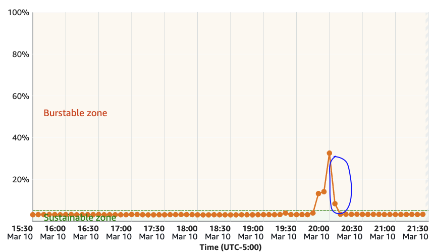
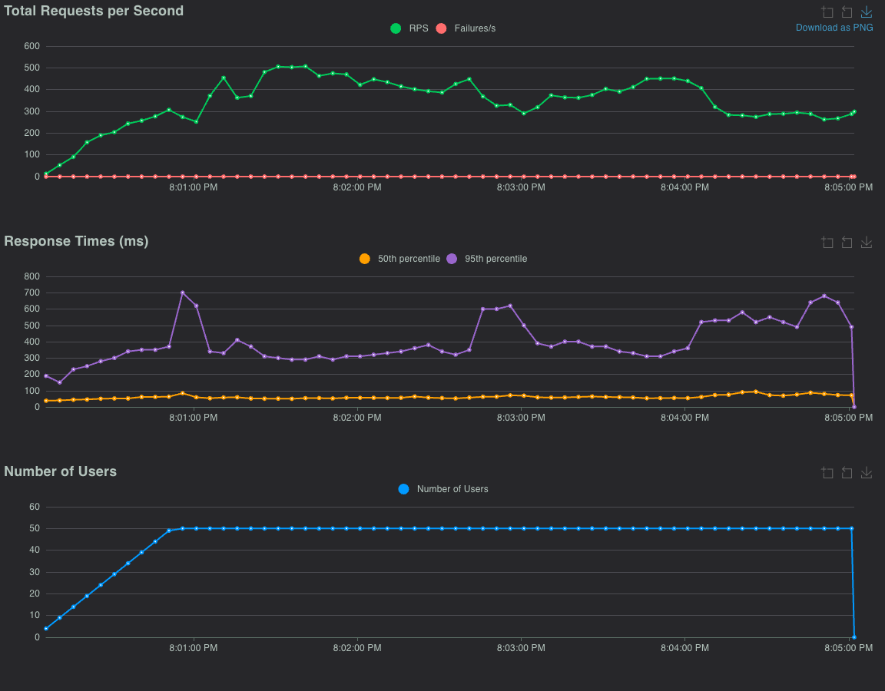
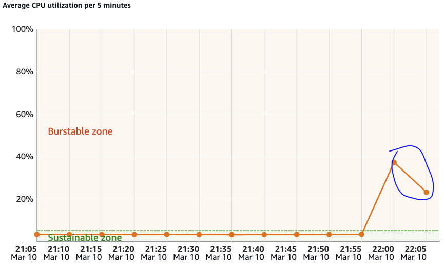
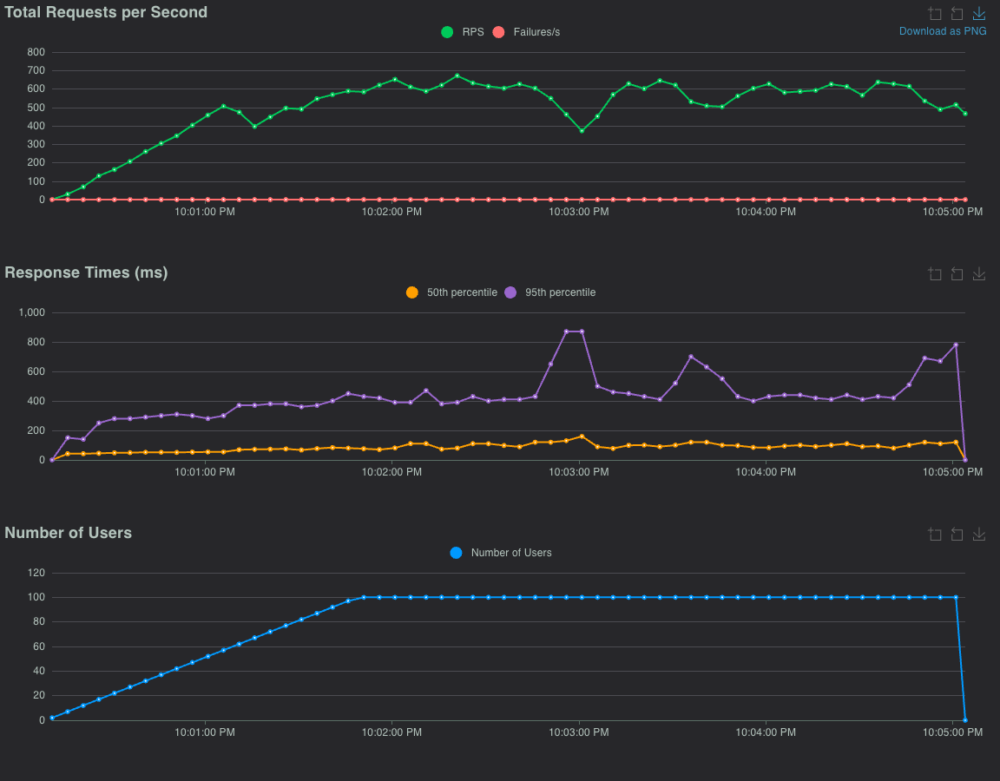
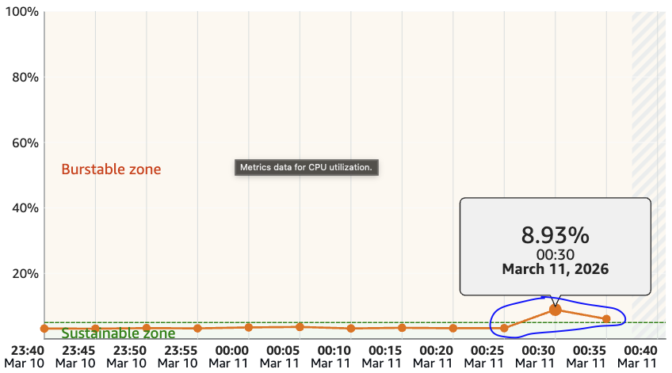
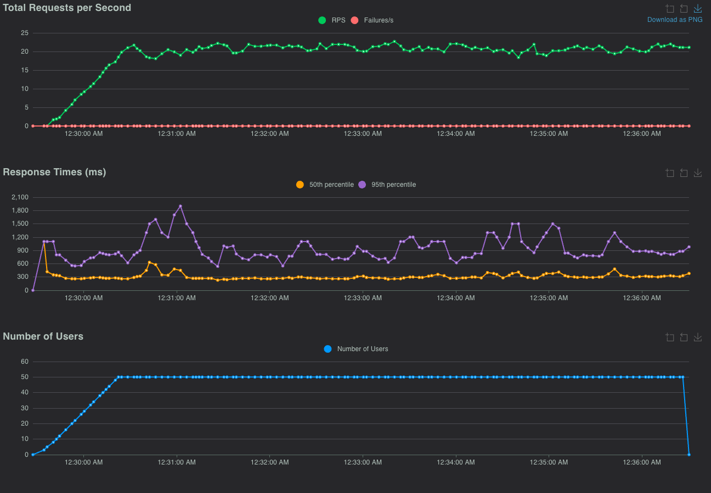
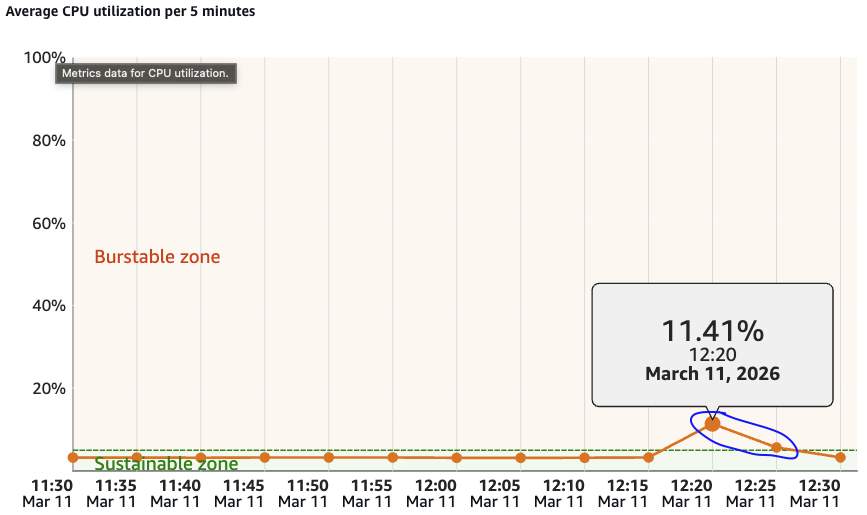
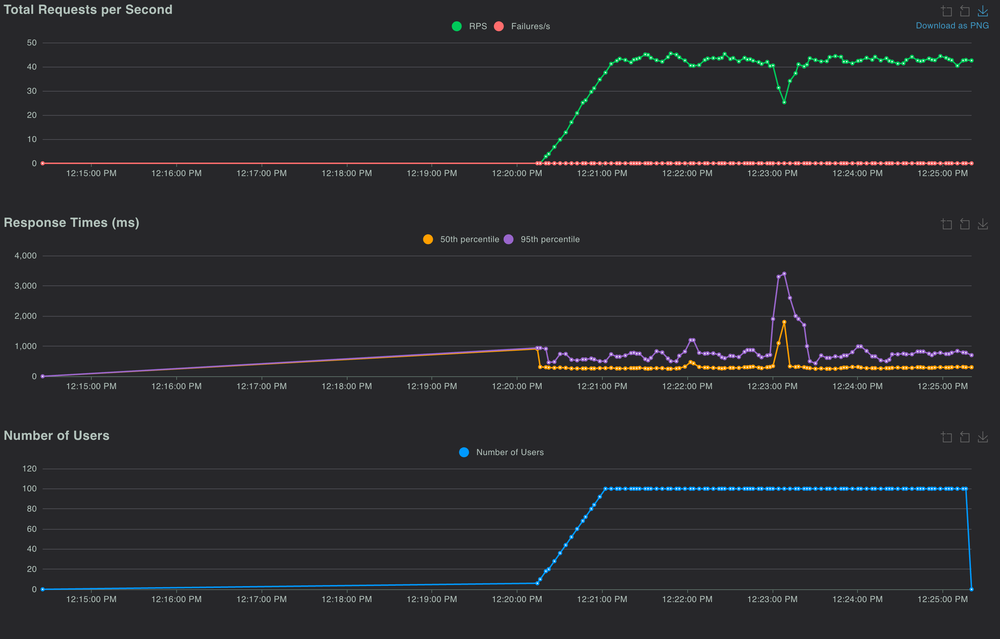
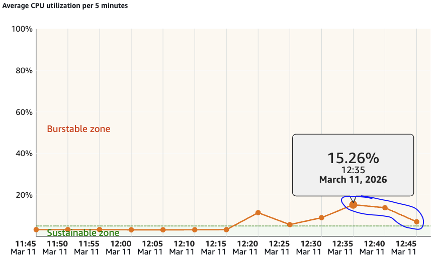
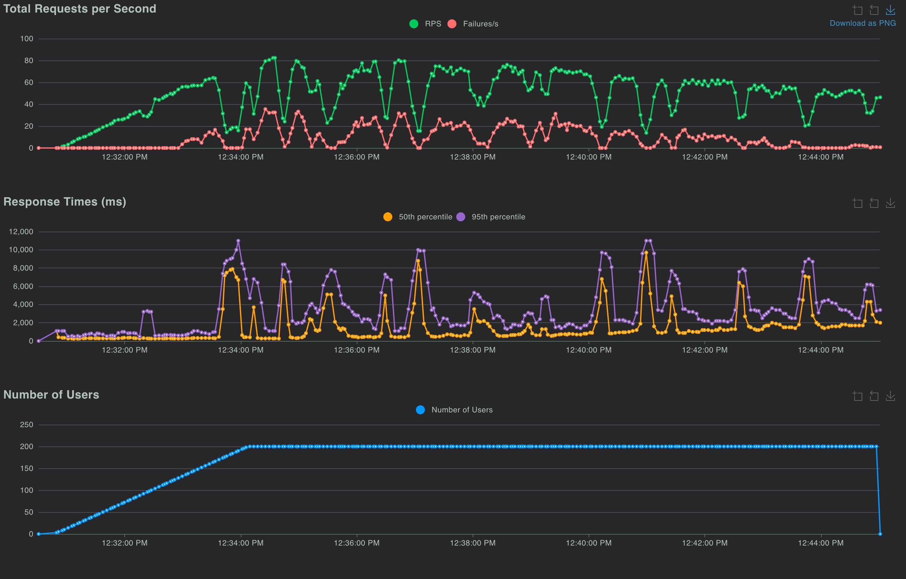

# --- 5 Minute Tests --- 
## "/" --> "/account" (50 users):
### Lightsail Instance Data:
  
### Locust Data:
  

## "/" --> "/account" (100 users):
### Lightsail Instance Data:
  
### Locust Data:
  

# Heavier workloads --- 5 Minute Tests --- 
## "/" --> "/recipes" --> "/recipes/view/2" --> "/dashboard" (50 users)
### Lightsail Instance data:
  
### Locust Data:
  

## "/" --> "/recipes" --> "/recipes/view/2" --> "/dashboard" (100 users)

### Lightsail Instance Data:

### Locust Data:
  

## Pushing the limits --- 200 Users --- 15 minutes ---

### Lightsail Instance Data:
  

### Locust Data:
  